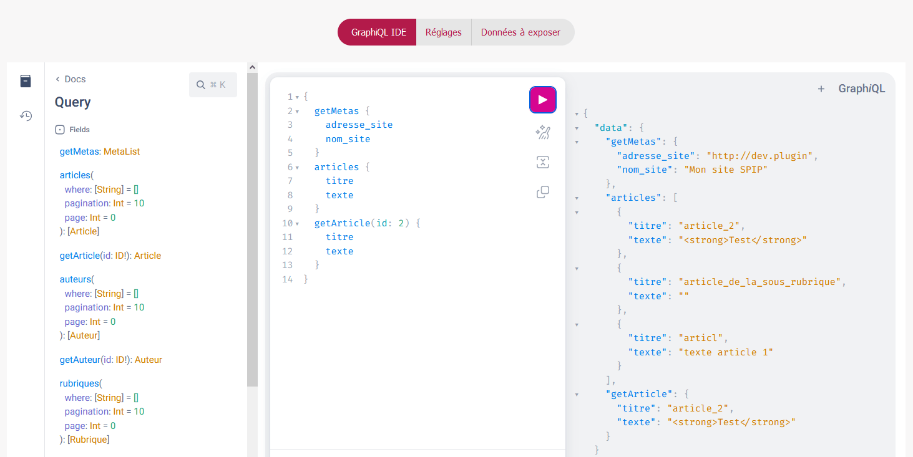
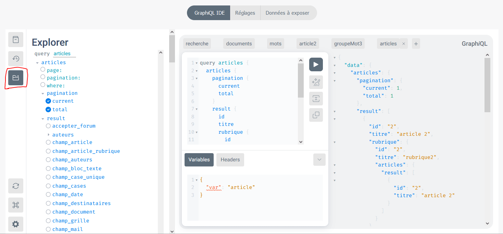
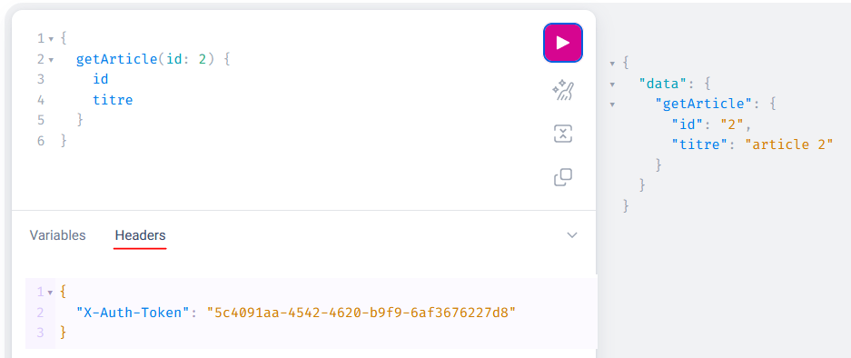
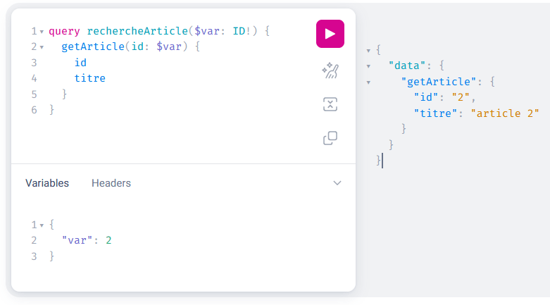

# SPIP GraphQL

## 1. But

Exposer un endpoint graphQL avec les données de SPIP grâce à la bibliothèque [graphql-php](https://github.com/webonyx/graphql-php)



## 2. Fonctionnement du plugin
- Création d 'une table `meta_graphql` pour stocker les informations de configuration du plugin
- Expose un point d'entrée unique sur `spip.php?action=graphql` grâce à la librairie [graphql-php](https://github.com/webonyx/graphql-php). Ce fichier prépare le contexte et lance le serveur graphQL en attente des requêtes. Nul besoin du plugin `http` !
- Toute la logique de l'API se situe dans le dossier `/schema`

## 3. Fonctionnement de l'API
### a. Apprendre graphQL
Si vous ne connaissaez pas graphQL, voici [la documentation](https://graphql.org/learn/).

### b. Les types disponibles
Les requêtes graphQL sont fortement typées. Les types sont créés dynamiquement en fonction des objets éditoriaux que vous aurez sélectionnés dans le Back-Office.

Grâce au [schéma d'introspection](https://graphql.org/learn/introspection/), les clients peuvent afficher les types de données disponibles. Voici les types actuellement disponibles :

- Les types de bases (scalaires) : `ID`, `String`, `Int`, `Boolean`
- Le type scalaire personnalisé `Date` qui permet d'indiquer le format des dates attendu
- Le type `MetaList` qui représente les metas exposées
- Le type [`ENUM Collection`](https://graphql.org/learn/schema/#enumeration-types) pour récupérer les collections exposées
- Le type `Pagination` pour connaître la page courante et le nombre de pages total dans une collection.
- Le type [`Interface Objet`](https://graphql.org/learn/schema/#interfaces) utilisé par les objets éditoriaux pour partager des champs en communs. Ce type expose les champs `id`, `titre`, `descriptif`, `logo`, `maj`, `slug`, `typeCollection`, `points` et `rang`. Le champs `points` (et non le shampooing :p ) sert lors de la requête `recherche`. Le champs `rang` sert lorsqu'un préfixe est utilisé dans le titre de l'objet. Le champ `typeCollection` représente une des collections exposées et est de type `ENUM Collection`. Le champ slug sert à slugifier le titre (il faudrait pouvoir récupérer un objet par son slug).
- Les types `MonObjet` (par ex : `Article`) liés aux objets éditoriaux. Les autres champs de la BDD spécifiques à l'objet peuvent être sélectionnés dans le Back-Office.
- Les types `MonObjetPagination` (par ex : `ArticlePagination`) permet de retourner une liste de `MonObjet` avec la pagination.
- Le type `SearchResult` (utilisé dans la recherche) permet de retourner n'importe quel type d'objet éditorial exposé ([type `UNION`](https://graphql.org/learn/schema/#union-types)).

### c. Les requêtes disponibles
Les requêtes disponibles sont aussi affichées par les clients grâce au schéma d'introspection.
Le client JS intégré au plugin (ou votre extension navigateur) utilise ce schéma pour afficher les requêtes disponibles.
Pour le moment, les requêtes disponibles sont :
- `getMetas`
- `getCollections`
- `recherche` qui prend un paramètre `texte`
- `maCollection` et `getMonObjet` pour chaque collection exposée

Les requêtes `getMonObjet` reçoivent un `id` en paramètre et les requêtes `maCollection` peuvent recevoir les paramètres suivants :
- `orderby` pour indiquer le sens de la liste `id_article_ASC`
- `where` (un tableau de string comme `['id_rubrique=1','id_trad=2']`)
- `pagination` pour indiquer le nombre d'items dans la pagination
- `page` pour indiquer la page voulue dans la pagination

L'API gère les relations 1 => N et les relations N => N (Attention à bien exposer les collections liées et les clés étrangères dans la liste des champs dans le backoffice).

## 4. Tester les requêtes
Le endpoint est joignable sur `spip.php?action=graphql`

Vous pouvez utiliser [graphiql](https://github.com/graphql/graphiql) qui est intégré dans le plugin ou une extension pour votre navigateur. Concernant Firefox, j'utilise [Altair GraphQL Client](https://addons.mozilla.org/fr/firefox/addon/altair-graphql-client/). A part pour le client intégré qui pointe directement sur votre endpoint, il faut renseigner l'url complète de votre API : http://domain.local/spip.php?action=graphql

Dans le client intégré, un plugin a été rajouté pour faciliter la construction de vos requêtes.



Voici un exemple de requête graphQL que vous pouvez tester :
```
{
  getMetas {
    nom_site
    slogan_site
    adresse_site
  }
  articles(where: ["maj>2022-10-02 00:00:00"], page: 2, pagination: 5) {
    result {
      ...objetFields
      texte
      auteurs {
        result {
          ...objetFields
        }
      }
      rubrique {
        ...objetFields
      }
    }
    pagination {
      current
      total
    }
  }
  getDocument(id:2) {
    ...objetFields
    extension
    fichier
  }
  rubriques(where:["profondeur=0"]) {
    result {
      ...objetFields
      articles {
        result {
          ...objetFields
        }
      }
    }
  }
  recherche(texte:"ma recherche") {
    ... on Article {
      ...objetFields
      chapo
      texte
    }
	... on Rubrique {
      ...objetFields
      texte
      parent {
        ...objetFields
	  }
    }
  }
}

fragment objetFields on Objet {
  id
  titre
  descriptif
  maj
}
```
Si vous activez le jeton, vous devez l'intégrer dans l'en-tête de vos requêtes.

Par exemple avec le client graphiql intégré dans le back-office :


Pour utiliser des variables dans vos clients, voici [la manière recommandée](https://www.apollographql.com/docs/react/data/operation-best-practices/#use-graphql-variables-to-provide-arguments) pour pouvoir facilement injecter, par ex, une saisie utilisateur dans la requête :


## 5. Contribuer
N'hésitez pas à contribuer : le code est extrêmement bien commenté

### Pré-requis
- Avoir un site SPIP fonctionnel avec des objets éditoriaux.
- Avoir installé [composer](https://getcomposer.org/).
- Activez le mode debug du plugin pour récupérer les erreurs PHP dans la réponse de l'API.
- En cas d'ajout ou de suppression de fichier dans le dossier `schema`, lancez la commande `composer update` pour prendre en compte vos modifications.

### Lien vers la documentation de la librairie graphql-php

https://webonyx.github.io/graphql-php/
